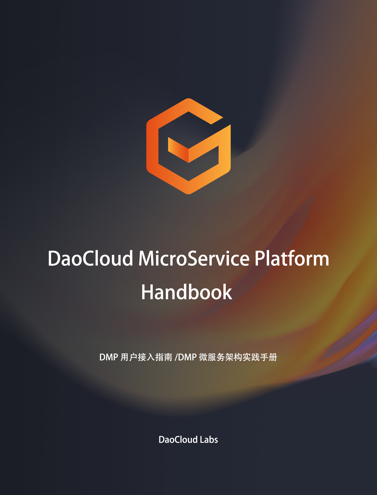

# DaoCloud Microservices Platform (DMP)

***当前版本：DMP v2.0.2***

#### 用户接入手册版本列表：
- [DMP 1.4](https://github.com/DaoCloud-Labs/DMP-Public-Docs/releases/tag/v1.4)
- [DMP 2.0.0](https://github.com/DaoCloud-Labs/DMP-Public-Docs/releases/tag/v2.0.0)

DaoCloud Microservices Platform，即 DaoCloud 微服务治理平台，是支撑企业微服务架构应用的一站式微服务治理与监控平台：

* 全面兼容 Spring Cloud 微服务框架，提供高可靠，高性能的企业级微服务基础组件。
* 服务管理覆盖微服务的整个生命周期，支持服务元数据管理，服务分组与搜索，服务上线与下线，服务（外部访问）路由策略，服务熔断，服务（外部访问）安全策略，服务（外部访问）流控策略。
* 服务监控涵盖了应用监控（JVM和应用相关指标）和链路追踪，同时客户端 SDK 可以通过埋点，支持对业务指标的监控。

# 官网

https://www.daocloud.io/dmp

# 文档站介绍

本文档站详细介绍了客户**应用**如何快速接入到 DMP 平台，并提供了相关的 Demo 以及源码，供用户参考。