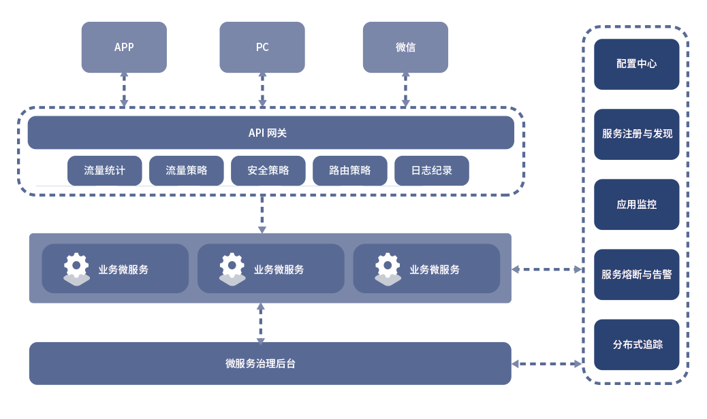

# DaoCloud Microservices Platform (DMP)

***当前版本：DMP v2.0.0***
#### 之前版本的用户接入手册：
- [DMP 1.4](https://github.com/DaoCloud-Labs/DMP-Public-Docs/releases)

DaoCloud微服务治理平台，是支撑企业微服务架构的一站式微服务治理与监控平台：

* DMP全面兼容 Spring Cloud 微服务框架，提供高可靠，高性能的企业级微服务组件。
* DMP的服务管理覆盖微服务的整个生命周期，支持服务元数据管理，服务分组与搜索，服务上线与下线，服务（外部访问）路由策略，服务熔断，服务（外部访问）安全策略，服务（外部访问）流控策略。
* DMP的服务监控涵盖了应用监控（JVM和应用相关指标）和链路追踪，同时客户端SDK可以通过埋点，支持对业务指标的监控。

# 官网

https://www.daocloud.io/dmp

# 文档站介绍

此系列文档包含了**应用/服务**如何进行改造之后接入DMP的常见用法。并在文档中提供了演示的源码，供开发者参考使用。

