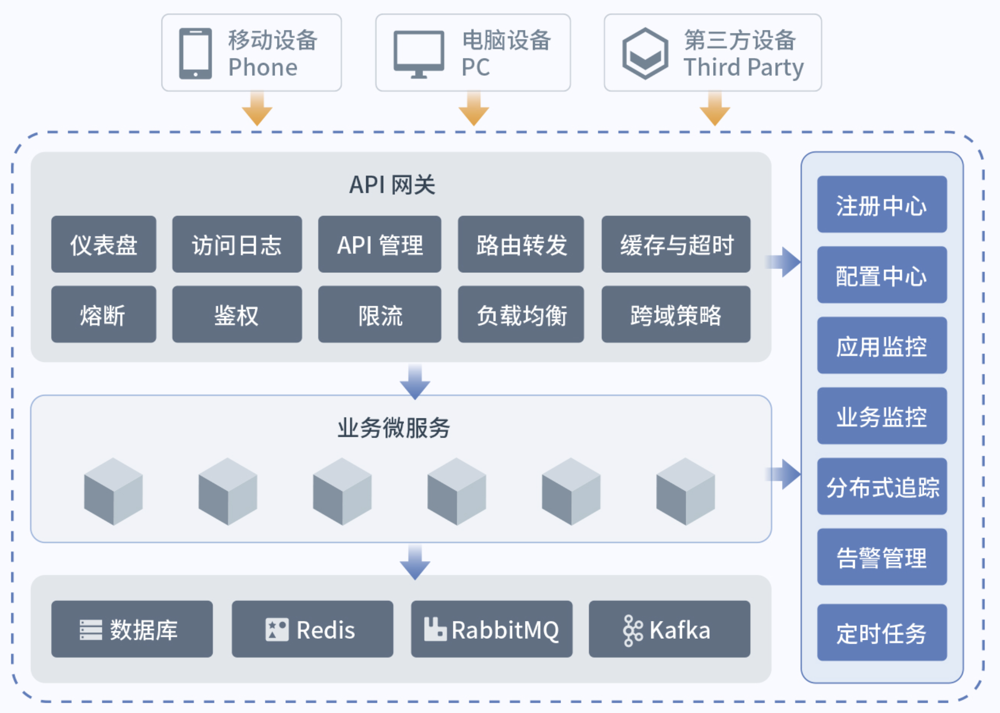

# Digital X Pilot——DaoCloud Microservices Platform (DMP)

***DMP v2.4.0***

* 全面兼容 Spring Cloud 微服务框架，提供高可靠，高性能的企业级微服务基础组件。
* 服务管理覆盖微服务的整个生命周期，支持服务元数据管理，服务分组与搜索，服务上线与下线，服务（外部访问）路由策略，服务熔断，服务（外部访问）安全策略，服务（外部访问）流控策略。
* 服务监控涵盖了应用监控（JVM和应用相关指标）和链路追踪。

# 官网

[www.daocloud.io](https://www.daocloud.io/dmp)

# 文档站介绍

该文档站主要介绍 DMP 组件的接入相关操作说明。以及一些常见的问题及解决方法。
