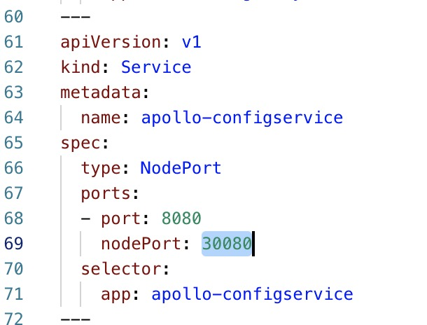
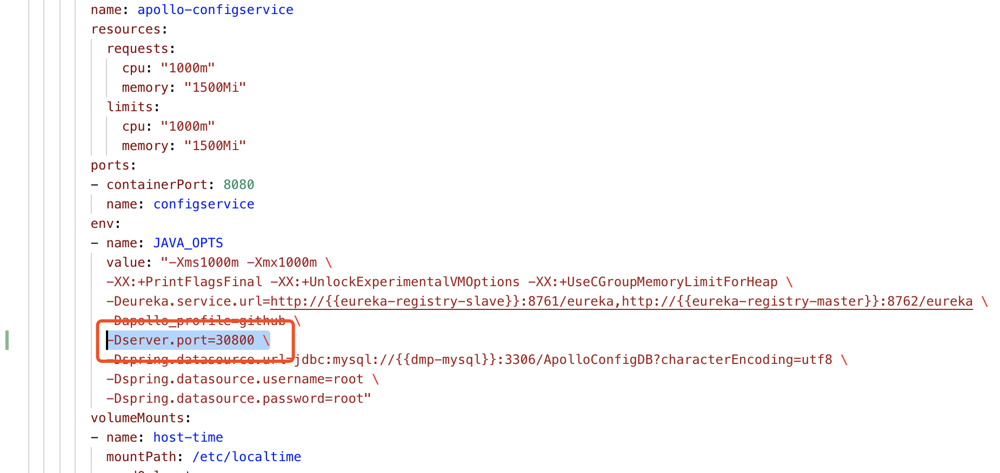
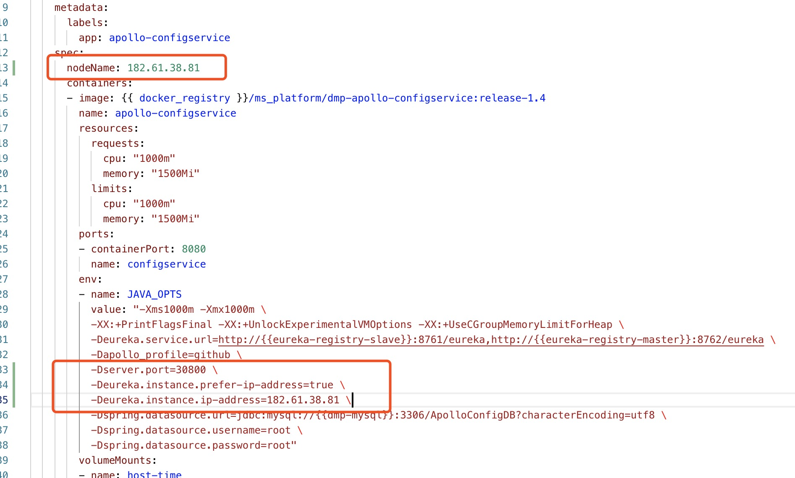

# Apollo-ConfigSerivce In Docker/k8s

本文档主要讲解异地**开发模式**下，无法拉取DMP中配置中心的配置项的问题。

**主要原因**为：客户端填入的`apollo.meta`地址为Apollo中的Meta Server地址，该地址是类似于一个Eureka Proxy的地址，因此并不是真正的Apollo-ConfigService地址。客户端在通过该地址拉取配置信息的时候，Meta Server会从Eureka中查询`Apollo-ConfigService`或者`DMP-Apollo-ConfigService`（以下简称"`ConfigService`"）的实例列表。该列表实例中包含的IP可能是容器的IP。最终导致异地开发时拉取不了配置的问题。

## 解决办法：

1、可以参考 [通过注解方式开启](annotation.md)末尾的方式。

2、让`Config Service`启动的时候将运行该服务的宿主机IP或NodeIp注册至Eureka。同时保持容器（或者k8s）暴露的端口和宿主机端口保持一致即可。

### 步骤:
**以下操作基于DMP提供的编排文件为例**

1、首先确保`Config Service`启动时暴露的端口和NodePort端口一致：
查看`service/dmp_svc.yml`文件中对`apollo-configservice`定义的NodePort：

上面69行中默认定义的是`30800`端口，具体按照实际情况。

我们去修改`depolyment/apollo.yml`中的环境变量，将`30800`端口传入进去：

如图，在配置中添加一行配置：

2、指定`ConfigService`运行的Node:
比如NodeIp为`182.61.38.81`:

3、客户端拉取配置时指定`apollo.meta`地址为：

`apollo.meta=http://182.61.38.81:30800` 

4、重启应用

重启`apollo depolyment`即可。
例如：
`kubectl [-n your namespace] apply -f apllo.yml`

