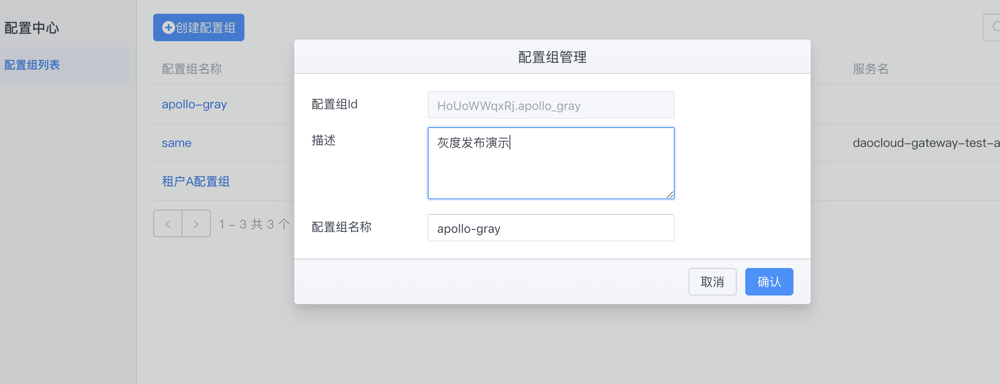
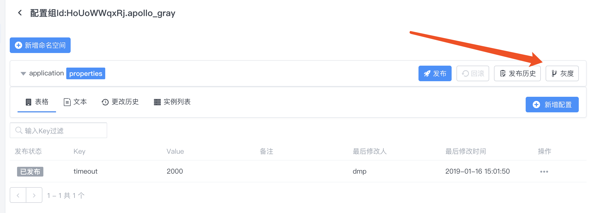
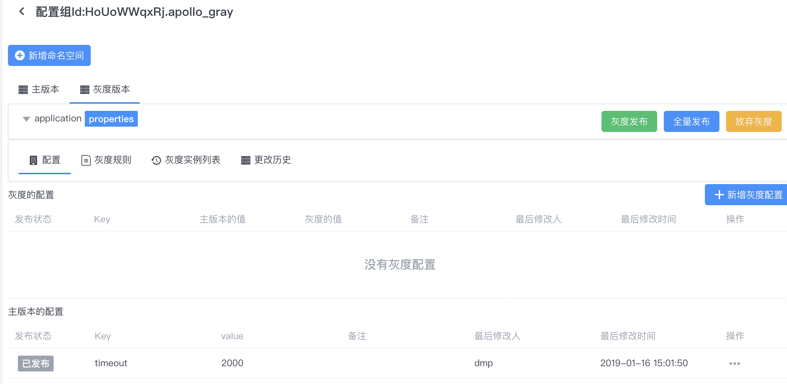
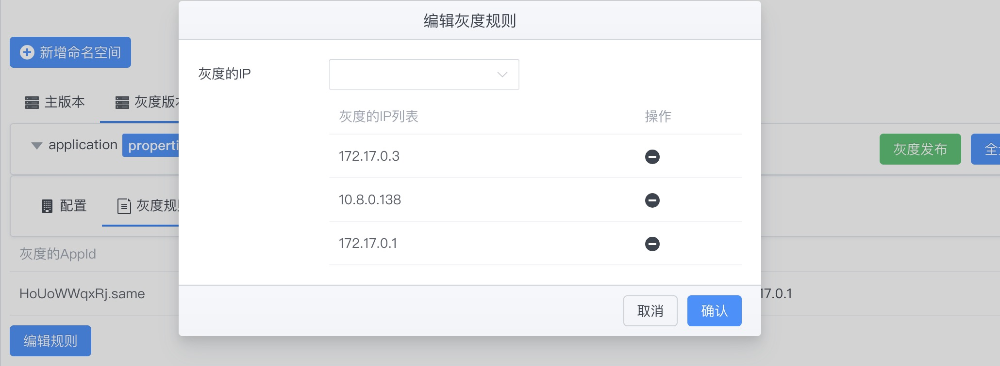
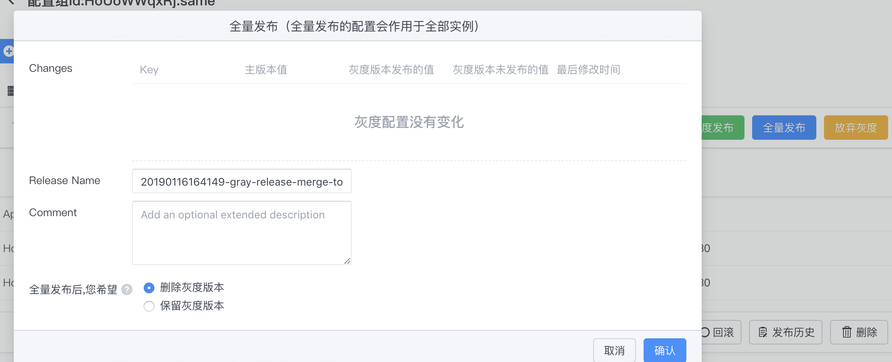
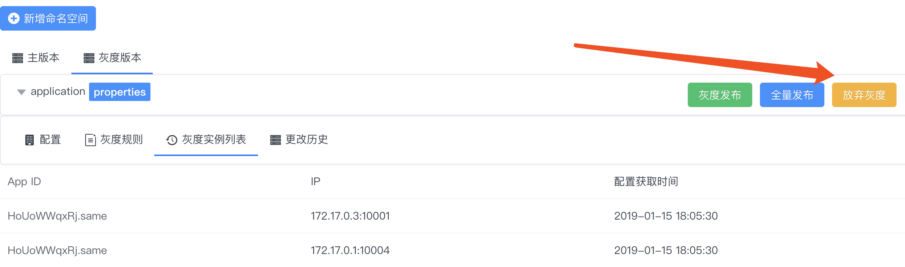

# 配置中心灰度发布使用指南
> 灰度发布是指在黑与白之间，能够平滑过渡的一种发布方式。A/B Test就是一种灰度发布方式，让一部用户继续用A，一部分用户开始用B，如果用户对B没有什么反对意见，那么逐步扩大范围，把所有用户都迁移到B上面 来。灰度发布可以保证整体系统的稳定，在初始灰度的时候就可以发现、调整问题，以保证其影响度。

通过灰度发布功能，可以实现：

- 对于一些对程序有比较大影响的配置，可以先在一个或者多个实例生效，观察一段时间没问题后再全量发布配置。
- 对于一些需要调优的配置参数，可以通过灰度发布功能来实现`A/B`测试。可以在不同的机器上应用不同的配置，不断调整、测评一段时间后找出较优的配置再全量发布配置。

下面将结合一个实际例子来描述如何使用灰度发布功能。

## 操作流程介绍
- 在配置中心创建配置组
- 在配置组中创建一个命名空间
- 为创建的命名空间添加灰度规则
- 添加灰度配置
- 灰度发布
- [灰度的]全量发布

### 1 创建配置组
配置中心配置组中存在着一个`appId=HoUoWWqxRj.apollo_gray`配置组：


### 2 创建命名空间
在创建配置组之后，默认会创建一个`application`命名空间。
可以在此空间中添加配置，此时的配置被称为`主版本`配置。
比如:

```bash
timeout = 2000
```


### 3 创建灰度

点击确定后，灰度版本就创建成功了，页面会自动切换到`灰度版本Tab`。
创建完灰度分支之后，会发现底部出现了主版本的配置，此时，可以通过右下角的操作按钮来对该配置进行灰度覆盖，以此创建出灰度值。你也可以直接添加新的灰度配置(key=value)。




随后进行`灰度发布`。

### 4 创建灰度规则
点击`编辑规则`,在实例IP列表下拉框中会默认展示当前使用配置的机器列表，选择我们要灰度的IP，点击完成。如果下拉框中没找到需要的IP，说明机器还没从配置中心取过配置，可以点击手动输入IP来输入。


### 5 灰度发布
配置规则已经生效，不过灰度配置还没有发布。切换到配置Tab。


### 5 实例拉取配置
客户端接入以及如何拉取配置可参考前面[通过注解方式开启](annotation.md)、[通过配置文件开启](bootstrap.md)介绍。
当客户端拉取配置的时候IP和灰度规则列表中的匹配，则客户端会拉取该灰度配置，并出现在灰度实例列表中。
比如：


### 6 [灰度的]全量发布

如果灰度的配置测试下来比较理想，符合预期，那么就可以操作`全量发布`。

全量发布的效果是：

- 灰度版本的配置会合并回主版本，在这个例子中，就是主版本的`timeout `会被更新成`1000`.
- 主版本的配置会自动进行一次发布
- 在全量发布页面，可以选择是否保留当前灰度版本，`默认为不保留`。



### 7 放弃灰度
如果灰度版本不理想或者不需要了，可以点击`放弃灰度`。
