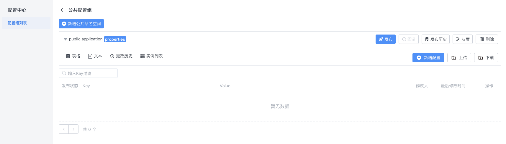

# 配置中心公共配置接入文档

## 一.配置中心使用

### 1.1 创建公共配置

在不存在公共配置组的情况下，点击创建配置组会有公共配置组的选项。(注:配置组名称和id都固定为public)


点击确认之后就会创建出如下配置组。注:只会存在唯一一个公共配置组。这个配置组会能被多个环境共享。


### 1.2 创建公共配置空间

创建一个公共配置组之后会有一个默认的名为public.application的公共命名空间。



可以通过新增公共命名空间添加命名空间，并且名称都会有public.前缀。

## 二.客户端使用

### 2.1 通过注释的方法使用公共配置

其他接入步骤不变,只需修改@EnableApolloConfig里面的参数

```java
 @SpringBootApplication
 @EnableApolloConfig({"public.application","application"})
 public class ApolloDemo3Application {
  public static void main(String[] args) {
        SpringApplication.run(ApolloDemo3Application.class, args);
     }
   }
```

**@EnableApolloConfig({"public.application","application"})** : 其中public.application为公共的命名空间，application为appId下的私有命名空间。
注: 放在前面的配置优先级比后面高。