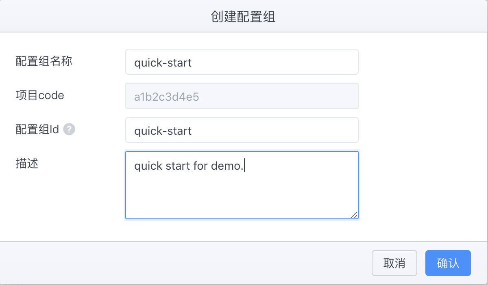

# DMP Quick Start-接入快速开始

## 在配置中心创建配置组




## 参数解释

| Key | 说明 | 示例 |
|:---|:---|:---|
| EUREKA_URL | Eureka 地址 | http://127.0.10.1:8761/eureka |
| APOLLO_CONFIGSERVICE | 配置中心ConfigService地址|http://127.0.10.2:8080 |
| APOLLO_APP_ID | 配置中心配置组ID| 上面步骤创建的：`a1b2c3d4e5.quick-start`|
| SW_AGENT_NAME |服务名称|dmp-quick-start-demo|
| SW_AGENT_COLLECTOR_BACKEND_SERVICES | 分布式追踪后端地址 |127.0.10.3:11800 |


## 运行

```bash

docker run -p 8080:8080 \
-e EUREKA_URL="http://localhost:8761/eureka" \
-e APOLLO_CONFIGSERVICE="http://localhost:8080" \
-e APOLLO_APP_ID="a1b2c3d4e5.quick-start" \
-e SW_AGENT_NAMESPACE=2  \
-e SW_AGENT_NAME=dmp-quick-start-demo  \
-e SW_AGENT_COLLECTOR_BACKEND_SERVICES=127.0.0.1:11800  \
-d  wutang/dmp-quick-start:2.0.x

```

## 访问容器

```bash

curl http://localhost:8080/hello

```

响应如下：`Hello World, Hello DMP!`

更改配置中心`a1b2c3d4e5.quick-start`中`application`命名空间中key为`quick.start`的value，可以是任意字符串。比如：`Hello,this is a test string for dmp-quick-start.`。


再次请求上面接口：

```bash

curl http://localhost:8080/hello

```

响应如下：`Hello,this is a test string for dmp-quick-start.`


