# Quick Start-快速接入

这一节的目的是介绍客户应用快速接入到 DMP 中，涉及到的概念或者原理请参考相关章节。

这里会以`daoshop-admin`服务为例，将会介绍如何接入Eureka服务注册中心、配置中心、应用监控和实例监控四个功能模块。

相关源码：[Github](https://github.com/DaoCloud-Labs/daoshop-admin)

## 前提条件
- 对Java、Spring Boot/Cloud 了解或者熟悉
- 对Docker了解或熟悉
- 对Kubernetes了解或熟悉
- 假设你已经创建了一个最简单的Spring Boot/Cloud工程项目。
- 演示使用各组件版本参考[pom.xml](https://github.com/DaoCloud-Labs/daoshop-admin/blob/master/pom.xml#L17)

## 接入准备
### 接入Eureka服务注册中心

- 在maven `pom.xml`中引入Eureka Client依赖：参考[pom.xml](https://github.com/DaoCloud-Labs/daoshop-admin/blob/master/pom.xml#L37)

```xml
......
<dependency>
	<groupId>org.springframework.cloud</groupId>
	<artifactId>spring-cloud-starter-netflix-eureka-client</artifactId>
</dependency>
......
```

- 添加或修改`src/main/resources/application.properties`对Eureka的配置内容,参考[application.properties](https://github.com/DaoCloud-Labs/daoshop-admin/blob/master/src/main/resources/application.properties#L9)：

```properties
......
eureka.client.service-url.defaultZone=${EUREKA_URL:http://daoshop-eureka:8761/eureka}
......
```

这里使用了`${EUREKA_URL:http://daoshop-eureka:8761/eureka}`的方式，这种方式允许我们通过`EUREKA_URL`环境变量的值来覆盖这里的配置。

### 接入配置中心
- 在配置中心创建配置组

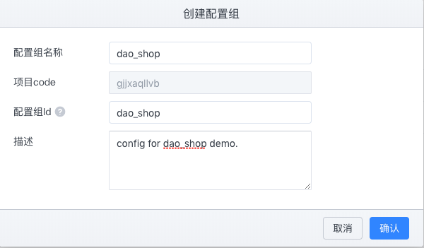

点击确认后，进入刚刚创建的配置组 ，里面有个默认的**application.prpperties**命名空间，我们点击**新增配置**。

出现弹框后在弹框中填写一下内容： 
- `key`:`daoshop.main.img`
- `value`: 可以是任意值，不过和daoshop-admin程序有关，这里配置的是图片URL。因此可以选择一个或多个，用逗号隔开。比如：`https://qiniu-download-public.daocloud.io/DaoCloud_MicroServices_Platform/dmp_logo.svg,https://www.daocloud.io/static/homepage/nvidia-gtc-china-2018.jpg,https://www.daocloud.io/static/contact-photo.png`.
填写完成点击**确认**，然后点击**发布**

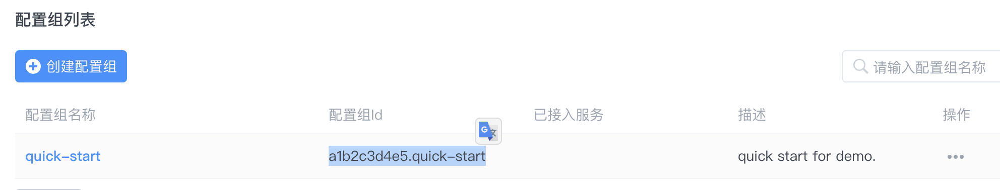

- 在maven `pom.xml`中引入Apollo Client依赖：参考[pom.xml](https://github.com/DaoCloud-Labs/daoshop-admin/blob/master/pom.xml#L23)

```xml
......
<dependency>
	<groupId>com.ctrip.framework.apollo</groupId>
	<artifactId>apollo-client</artifactId>
	<version>${apollo.client.version}</version>
</dependency>
......
```

**注意**：如果拉取不到依赖包，请在pom中添加daocloud的nexus仓库或自己的私服地址：

```xml
 <repositories>
        <repository>
            <id>labs-snapshots</id>
            <url>http://nexus.mschina.io/nexus/content/repositories/labs-snapshot/</url>
            <snapshots>
                <enabled>true</enabled>
            </snapshots>
        </repository>
        <repository>
            <id>labs-releases</id>
            <url>
                http://nexus.mschina.io/nexus/content/repositories/labs/
            </url>
        </repository>
</repositories>
```

- 在启动类上面添加注解,参考[AdminApplication](https://github.com/DaoCloud-Labs/daoshop-admin/blob/master/src/main/java/io/daocloud/shop/admin/AdminApplication.java#L8):

```java
......
@SpringBootApplication
@EnableApolloConfig
public class AdminApplication {
    public static void main(String[] args) {
        SpringApplication.run(AdminApplication.class, args);
    }
}
......
```

- 接着在程序中使用上面配置的URL配置项,参考[ImageController](https://github.com/DaoCloud-Labs/daoshop-admin/blob/master/src/main/java/io/daocloud/shop/admin/controller/ImageController.java#L21)：

```java
......
    @Value("#{'${daoshop.main.img:https://qiniu-download-public.daocloud.io/DaoCloud_MicroServices_Platform/dmp_logo.svg}'.split(',')}")
    private List<String> images;
    @GetMapping("/image/main")
    private List<String> getImgUrl(){
        return images;
    }
......
```


### 应用监控接入

- 在maven `pom.xml`中引入collector-client依赖：参考[pom.xml](https://github.com/DaoCloud-Labs/daoshop-admin/blob/master/pom.xml#L61)

```xml
......
<dependency>
	<groupId>io.daocloud.mircoservice</groupId>
	<artifactId>collector-client-starter-2x</artifactId>
	<version>${collector-client.version}</version>
</dependency>
......
```

### 分布式追踪接入

由于该功能接入是采用Java Agent探针的方式接入的，不需要对程序做调整。因此，直接包含在接下来构建镜像小节中。
 
### 构建镜像

- Dockerfile编写：

```bash
FROM openjdk:8-jre-alpine

LABEL maintainer="jian.tan@daocloud.io"

ENV DIST_NAME=admin \
    APP_VERSION=0.0.1-SNAPSHOT \
    AGENT_REPO_URL="http://nexus.mschina.io/nexus/content/repositories/labs/org/apache/skywalking/dmp/agent/2.0.1/agent-2.0.1.gz"

ADD $AGENT_REPO_URL /

COPY target/"$DIST_NAME-$APP_VERSION.jar" /"$DIST_NAME.jar"

RUN set -ex; \
    tar -zxf /agent-2.0.1.gz; \
    rm -rf agent-2.0.1.gz;
    
RUN ln -sf /usr/share/zoneinfo/Asia/Shanghai /etc/localtime \
    && echo "Asia/Shanghai" > /etc/timezone

EXPOSE 18083

ENTRYPOINT java  -javaagent:/skywalking-agent/skywalking-agent.jar \
           -XX:+PrintFlagsFinal -XX:+UnlockExperimentalVMOptions -XX:+UseCGroupMemoryLimitForHeap $JAVA_OPTS -jar /$DIST_NAME.jar
```

上面的`-javaagent:/skywalking-agent/skywalking-agent.jar`即为我们的服务加上分布式追踪的探针。

- maven 打包

```bash
mvn clean package -DskipTests
```

- Docker Build

```bash
docker build -t daoshop-shop-admin:2.0.x .
```

### 容器运行

- 运行容器需要的一些参数解释

| Key | 说明 | 示例 |
|:---|:---|:---|
| EUREKA_URL | Eureka 地址 | http://127.0.10.1:8761/eureka |
| APOLLO_CONFIGSERVICE | 配置中心ConfigService地址|http://127.0.10.2:8080 |
| APOLLO_APP_ID | 配置中心配置组ID| 上面步骤创建的：`gjjxaqllvb.dao_shop`|
| SW_AGENT_NAME |服务名称|daoshop_admin|
| SW_AGENT_COLLECTOR_BACKEND_SERVICES | 分布式追踪后端地址 |127.0.10.3:11800 |

- Docker Run运行

```bash
docker run -p 8080:8080 \
-e EUREKA_URL="http://127.0.10.1:8761/eureka" \
-e APOLLO_CONFIGSERVICE="http://127.0.10.2:8080" \
-e APOLLO_APP_ID="gjjxaqllvb.dao_shop" \
-e SW_AGENT_NAME=daoshop_admin  \
-e SW_AGENT_COLLECTOR_BACKEND_SERVICES=127.0.10.3:11800  \
-d  daoshop-shop-admin:2.0.x
```

- Kubernetes 运行

编排文件参考:[kubernetes.yml](https://github.com/DaoCloud-Labs/daoshop-admin/blob/master/kubernetes.yml):

```yml
apiVersion: apps/v1
kind: Deployment
metadata:
  namespace: test
  name: daoshop-shop-admin
  labels:
    app: daoshop-shop-admin
spec:
  selector:
    matchLabels:
      app: daoshop-shop-admin
  template:
    metadata:
      labels:
        app: daoshop-shop-admin
    spec:
      containers:
        - image: daoshop-shop-admin:2.0.x
          name: daoshop-shop-admin
          resources:
            requests:
              memory: "1000Mi"
              cpu: "200m"
            limits:
              memory: "1000Mi"
              cpu: "200m"
          ports:
            - containerPort: 18083
          volumeMounts:
            - name: host-time
              mountPath: /etc/localtime
              readOnly: true
          env:
            - name: APOLLO_APP_ID
              value: "gjjxaqllvb.dao_shop"
            - name: APOLLO_CONFIGSERVICE
              value: "http://127.0.10.2:8080"
            - name: SW_AGENT_NAME
              value: daoshop-shop-admin
            - name: SW_AGENT_COLLECTOR_BACKEND_SERVICES
              value: "127.0.10.3:11800"
            - name: EUREKA_URL
              value: "http://127.0.10.1:8761/eureka"
      volumes:
        - name: host-time
          hostPath:
            path: /etc/localtime
---
apiVersion: v1
kind: Service
metadata:
  namespace: test
  name: daoshop-shop-admin
spec:
  type: NodePort
  ports:
    - port: 18083
  selector:
    app: daoshop-shop-admin
```

```bash
kubectl apply -f kubernetes.yml
```

## 接入验证
### 访问接口

```bash
curl http://localhost:18083/admin/v1/image/main
```

响应如下：

```json
[
"https://qiniu-download-public.daocloud.io/DaoCloud_MicroServices_Platform/dmp_logo.svg",
"https://www.daocloud.io/static/homepage/nvidia-gtc-china-2018.jpg",
"https://www.daocloud.io/static/contact-photo.png"
]
```


### 此时进入DMP管理界面

- `daoshop_admin`服务上线

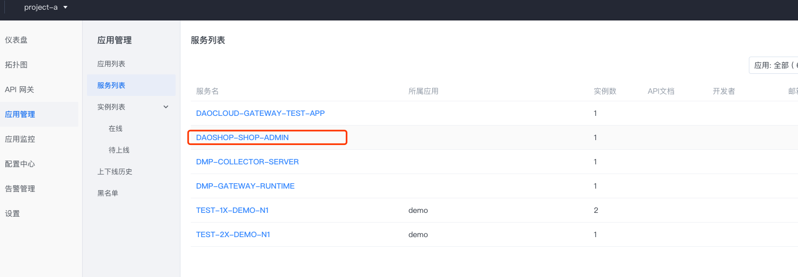

- 更改配置中心的值

更改配置中心`gjjxaqllvb.dao_shop`中`application`命名空间中key为`daoshop.main.img`的value，可以是任意字符串。比如：`https://www.daocloud.io/static/contact-photo.png`。

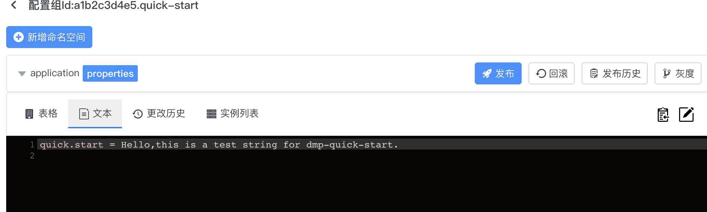

再次请求上面接口：

```bash
curl http://localhost:18083/admin/v1/image/main
```

响应如下：

```json
[
"https://www.daocloud.io/static/contact-photo.png"
]
```

- 查看拓扑图

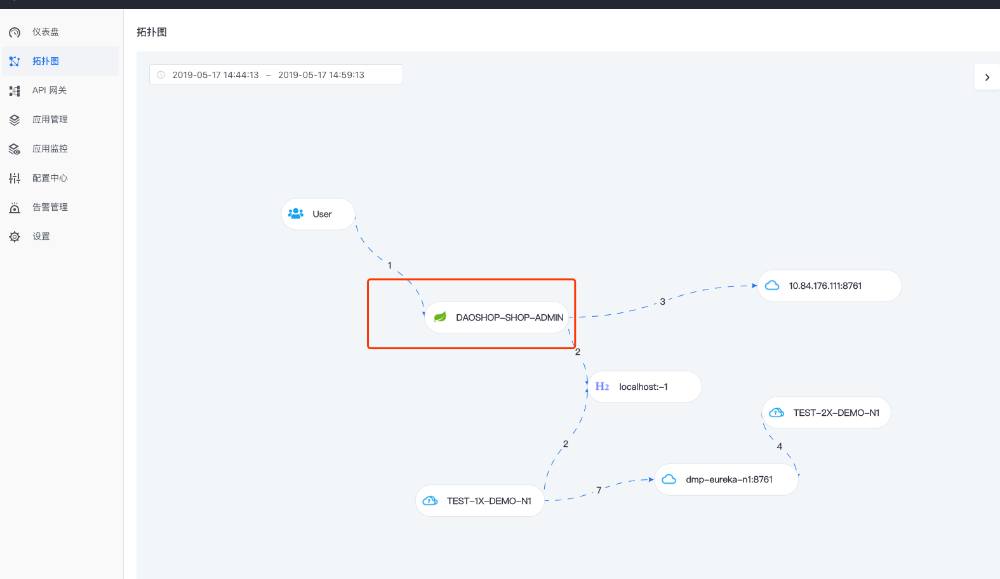

选择`DAOSHOP-SHOP-ADMIN`进入服务监控：

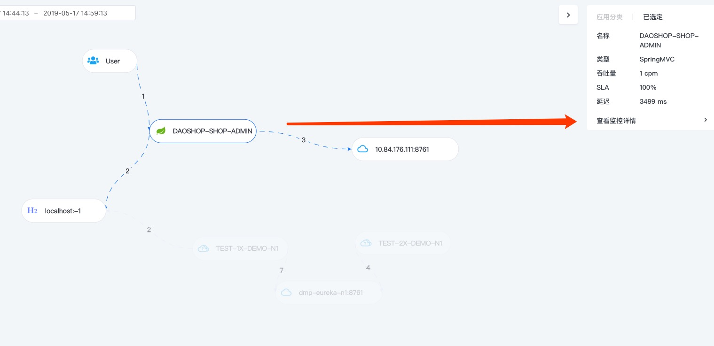
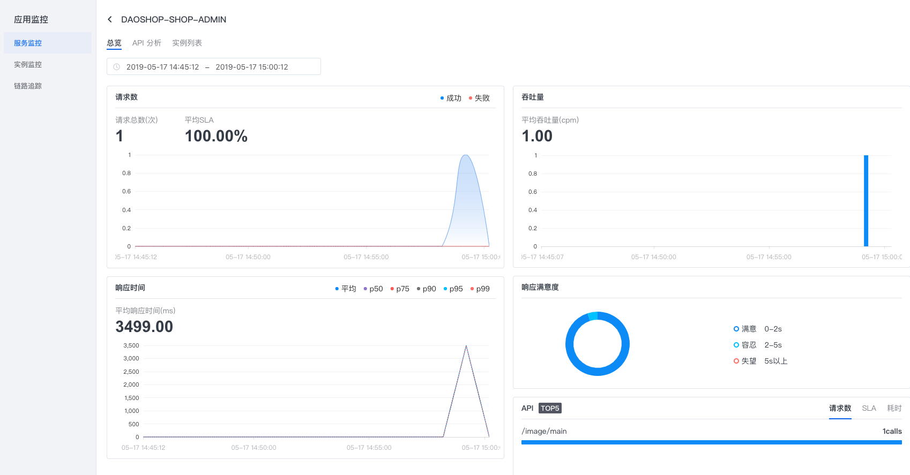

点击Tab中`实例列表`:

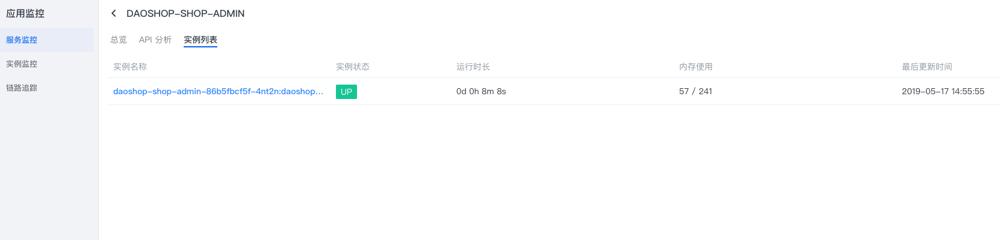

选中实例名称，可以跳转至实例监控页面：

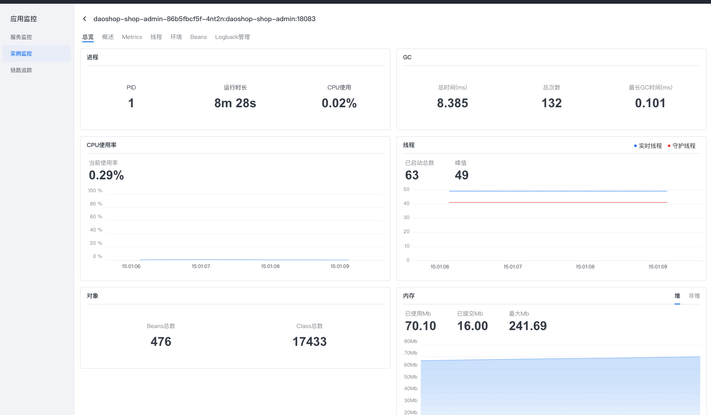

- 网关转发配置

创建API：

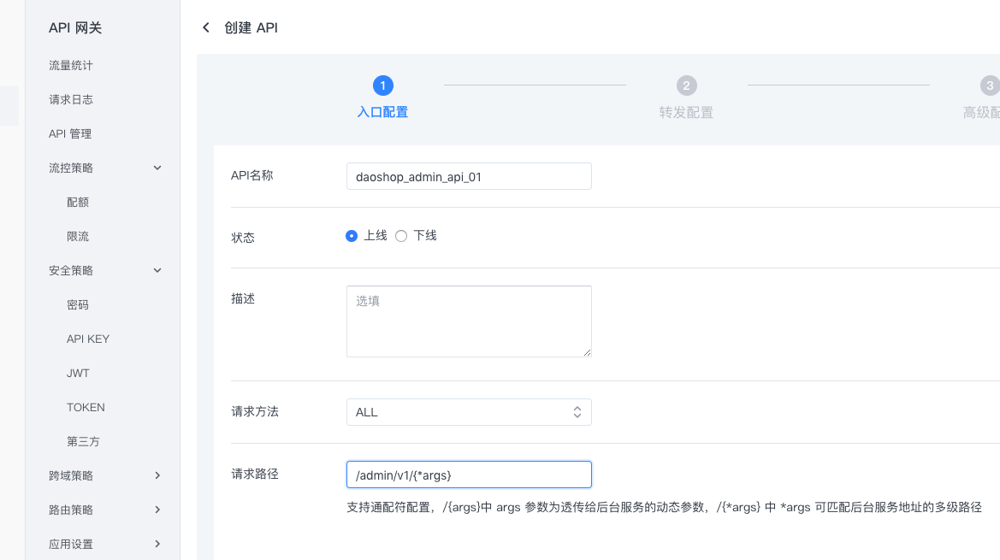

为API创建转发策略：

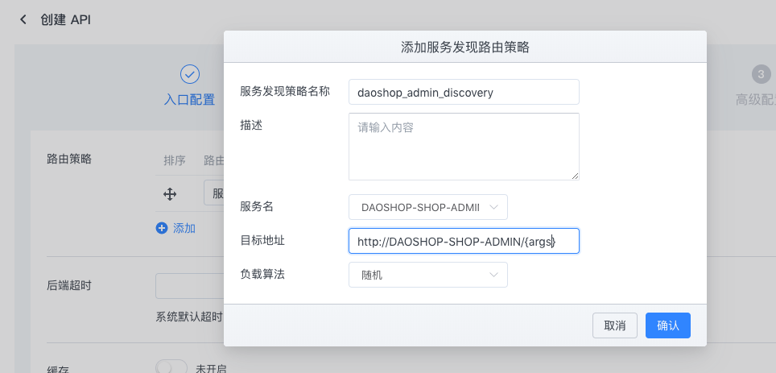

- 请求网关:
 
```bash
curl dmp-gateway-runtime-n1:9032/admin/v1/admin/v1/image/main
```
随后查看该API的一些监控信息：

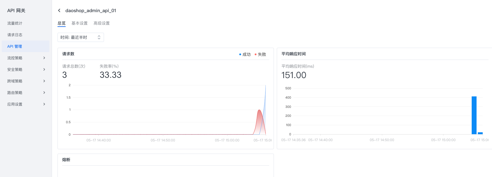


更多操作和接入说明请移步后续章节或**产品使用手册**。


