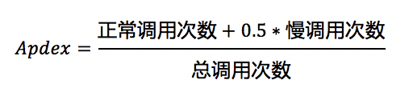

# 基础术语
| 术语 | 说明 |
|:---|:---|
|服务拓扑|拓扑是对服务间调用关系和依赖关系的可视化展示。|
|CPM | Call Per Minites. 每分钟的调用数。|
| SLA | Service-Level Agreement的缩写,计算公式`(((calls - errorCalls) * 100) / calls)`|
| Apdex|应用性能指标，全称 Application Performance Index，用于对应用性能的量化评估，基于用户定义的应用响应时间阈值 (Apdex T) 计算得到，为 0 至 1 之间的数值。Apdex 从用户角度出发，将应用性能表现分为三个等级：满意、容忍、失望。控制台界面中分别使用不同颜色来区分。|
|Apdex 阈值|用于 Apdex 计算的应用响应时间阈值，通常用 T 表示。数值由用户定义，单位为毫秒 (ms)，默认值为 100 ms。更多信息请参考下面的**Apdex 原理及计算规则**|
|Tracer|标识整个请求链，即一些列 Span 的组合。其自身的 ID 将贯穿整个调用链，其中的每个 Span 都必须携带这个 traceId，因此 traceId 将在整个调用链中传递。|
|TraceID|TraceId 指的是 Tracer 中代表唯一一次请求的 ID，此 ID 一般由集群中第一个处理请求的系统产生。|
|错误率| 在指定时间段内基于请求数的出错比例。|
| 吞吐量|在指定时间段内处理请求的吞吐量走势|
|RT 分布图|应用在指定时间段内处理请求响应时间（Response Time）分布图。绿点代表请求响应成功；红点代表请求响应失败。|

## Apdex 原理及计算规则
Apdex 基于用户定义的应用响应时间阈值 (Apdex T) 计算得到，将对应用响应时间的统计结果转为用户对于应用性能的可量化范围为 0 至 1的满意度评价。基于真实的用户体验，Apdex 将应用性能表现分为三个等级：满意、容忍、失望。

Apdex 应用性能等级与响应时间的对应关系见下表：

| 响应分类 | 响应耗时 (RT) | 用户满意度等级 |
|:---:|:---:|:---:|
|正常调用|0 < RT <= T|Satisfied（满意）|
|慢调用|T < RT <= 4T	|Tolerating（容忍）|
|极慢调用|RT > 4T|Frustrated（失望）|

Apdex 分值计算公式如下：

例如，当 T = 100 ms 时，在某个时间段内，某应用响应耗时低于 100 ms 的调用（即正常调用）次数 60 次，耗时在 100 ms 至 400 ms 之间的调用（即慢调用）次数 20 次，耗时多于 400 ms 的调用（即极慢调用）与错误调用次数合计 20 次，则该应用在该时段内的 Apdex= (60 + 0.5 * 20) / (60 + 20 + 20) = 0.7，其性能状态为良

## Span信息：
|key|解释|
|:---|:---|
| url |请求地址|
| component |所属组件|
| is error | 出现错误。true/false |
| status_code |请求状态|
| peer | 端点地址 |
| db.type |数据库类型|
|db.instance|数据库实例|
|db.statement|sql语句|
|db.bind_vars|sql变量绑定|
|mq.queue|消息队列名称|
|mq.broker|broker地址|
|mq.topic|消息队列主题|
|http.method|请求方法|
